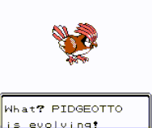

# Falco Project Evolution

This repo aims to document the evolution process of The Falco Project.

In particular, this repository provides a space for the community to work together, discuss ideas, document processes, and productively make decisions.

## Adoption model

The criteria will remain loose and tightened as needed at the discretion of the Falco open source community.

### Sandbox

You can find "*Sandbox*" level ideas/projects/code under the [falcosecurity/contrib](https://github.com/falcosecurity/contrib) repository.

<!-- REPOSITORY-SANDBOX-TABLE -->
|                               NAME                                |                     DESCRIPTION                     |
|-------------------------------------------------------------------|-----------------------------------------------------|
| [falcosecurity/contrib](https://github.com/falcosecurity/contrib) | Community sandbox to test-drive ideas/projects/code |
<!-- /REPOSITORY-SANDBOX-TABLE -->

### Incubating

The "*Incubating*" level refers to those projects (usually promoted from "*Sandbox*") that need their repository.

This status is assigned as needed, and can best be measured by the need to cut a release and use the GitHub release features.

<!-- REPOSITORY-INCUBATING-TABLE -->
|                                           NAME                                            |                                DESCRIPTION                                |
|-------------------------------------------------------------------------------------------|---------------------------------------------------------------------------|
| [falcosecurity/client-go](https://github.com/falcosecurity/client-go)                     | Go client and SDK for Falco                                               |
| [falcosecurity/driverkit](https://github.com/falcosecurity/driverkit)                     | Kit for building Falco drivers: kernel modules or eBPF probes             |
| [falcosecurity/event-generator](https://github.com/falcosecurity/event-generator)         | Generate a variety of suspect actions that are detected by Falco rulesets |
| [falcosecurity/falco-exporter](https://github.com/falcosecurity/falco-exporter)           | Prometheus Metrics Exporter for Falco output events                       |
| [falcosecurity/falco-aws-terraform](https://github.com/falcosecurity/falco-aws-terraform) |                                                                           |
| [falcosecurity/falcoctl](https://github.com/falcosecurity/falcoctl)                       | Administrative tooling for Falco                                          |
| [falcosecurity/falcosidekick](https://github.com/falcosecurity/falcosidekick)             | Connect Falco to your ecosystem                                           |
| [falcosecurity/falcosidekick-ui](https://github.com/falcosecurity/falcosidekick-ui)       | A simple WebUI with latest events from Falco                              |
| [falcosecurity/kernel-crawler](https://github.com/falcosecurity/kernel-crawler)           | A tool to crawl Linux kernel versions                                     |
| [falcosecurity/kilt](https://github.com/falcosecurity/kilt)                               | Kilt is a project that defines how to inject foreign apps into containers |
| [falcosecurity/libs-sdk-go](https://github.com/falcosecurity/libs-sdk-go)                 | Go SDK for Falco libs                                                     |
| [falcosecurity/plugin-sdk-cpp](https://github.com/falcosecurity/plugin-sdk-cpp)           |                                                                           |
| [falcosecurity/test-infra](https://github.com/falcosecurity/test-infra)                   | Falco workflow & testing infrastructure                                   |
<!-- /REPOSITORY-INCUBATING-TABLE -->

### Official Support

As the need for a project grows, it can ultimately achieve the highest and most coveted status within The Falco Project: "*Official support*."

As per [our governance model](https://github.com/falcosecurity/.github/blob/master/GOVERNANCE.md#adding-new-projects-to-the-falcosecurity-github-organization), to request a project to be added or promoted, please open an [issue](https://github.com/falcosecurity/evolution/issues/new/choose), and choose the appropriate template. Once a sufficient discussion has taken place and the proposal has been accepted, the project will be listed in the table below with the given status.

<!-- REPOSITORY-OFFICIAL-TABLE -->
|                                         NAME                                          |                               DESCRIPTION                                |
|---------------------------------------------------------------------------------------|--------------------------------------------------------------------------|
| [falcosecurity/charts](https://github.com/falcosecurity/charts)                       | Community managed Helm charts for running Falco with Kubernetes          |
| [falcosecurity/deploy-kubernetes](https://github.com/falcosecurity/deploy-kubernetes) | Kubernetes deployment resources for Falco                                |
| [falcosecurity/falco](https://github.com/falcosecurity/falco)                         | Cloud Native Runtime Security                                            |
| [falcosecurity/falco-website](https://github.com/falcosecurity/falco-website)         | Hugo content to generate website content. Hosted by the CNCF             |
| [falcosecurity/libs](https://github.com/falcosecurity/libs)                           | libsinsp, libscap, the kernel module driver, and the eBPF driver sources |
| [falcosecurity/plugin-sdk-go](https://github.com/falcosecurity/plugin-sdk-go)         |                                                                          |
| [falcosecurity/plugins](https://github.com/falcosecurity/plugins)                     |                                                                          |
<!-- /REPOSITORY-OFFICIAL-TABLE -->

### Special repositories

Some repositories have a special meaning and do not fit the above statuses. These are:

<!-- REPOSITORY-SPECIAL-TABLE -->
|                                 NAME                                  |              DESCRIPTION               |
|-----------------------------------------------------------------------|----------------------------------------|
| [falcosecurity/.github](https://github.com/falcosecurity/.github)     | Default community health files         |
| [falcosecurity/community](https://github.com/falcosecurity/community) | The Falco Project Community            |
| [falcosecurity/evolution](https://github.com/falcosecurity/evolution) | Evolution process of The Falco Project |
<!-- /REPOSITORY-SPECIAL-TABLE -->

### Archivied repositories

In general, a repository can be archived at the discretion of The Falco Project community. Usually, maintainers can decide to archive a project that has not been maintained for a long time or does not fit the guidelines for the projects under the [falcosecurity](https://falcosecurity) GitHub's organization anymore. In other cases, a repository is archived to reserve its name for future use.

The list of archived repositories can be found [here](https://github.com/falcosecurity?q=&type=archived&language=&sort=name).

### Retired projects

Finally, projects that are no longer maintained or relevant to The Falco Project will be retired definitively. Periodically, the maintainers clean up the [falcosecurity](https://github.com/falcosecurity) and move these projects to the [Falco Projects Retirement Home](https://github.com/falcosecurity-retire) GitHub's organization.

## Contributing

See the [contributing guide](https://github.com/falcosecurity/.github/blob/master/CONTRIBUTING.md) and the [community code of conduct](https://github.com/falcosecurity/.github/blob/master/CODE_OF_CONDUCT.md).

## Join the Community

To get involved with the evolution of The Falco Project, please visit [the community repository](https://github.com/falcosecurity/community) to find more.
